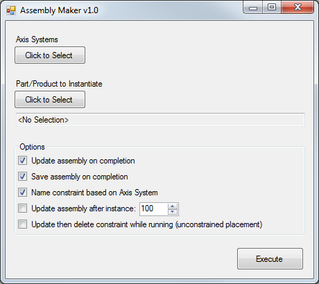
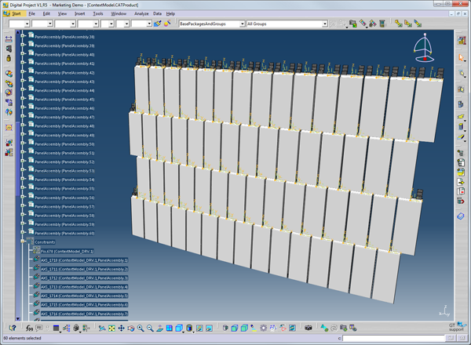

#AssemblyMaker#

##Version##
Assembly Maker v1.0  
2013/07/19 by Neil Meredith <neil@sheetd.com>  

##Requirements##
Digital Project V1R5 or CATIA V5-6R2012 (aka R22) or higher

##Description##
Assembly Maker is a CATIA/Digital Project tool that allows you to batch insert a part/product in to an assembly and then constrains the axis system of new part/product to a selection of axis systems. 

##Usage##
- Open "ContextModel.CATProduct" (and load in Design Model if you are using the Cache system).  
- Run AssemblyMaker application  
- Select any of the axis systems in the driver part "ContextModel_DRV"  
- Select the part/product to instantiate (for example "/AssemblyModel/PanelAssembly.CATProduct")  
- Run the program

##Limitations##
- Axis systems between the various parts should match "handendness"  
- Axis systems in the driver part and in the assembly should be published (see sample parts)  
- All parts/products ussed in the assembly should be saved prior to running the AssemblyMaker  
- The 1st publication in the assembly part/product will be used in creating the axis-to-axis assembly constraints  
